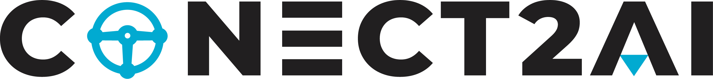

&nbsp;
&nbsp;

<p align="center">
  

# Metodologia Orientada a Agentes de Linguagem para Assistência Automotiva: Integrando Engenharia de Prompts em Chatbots Avançados

### ✍🏾 Autores: [Thaís Medeiros](https://github.com/thaisaraujom), [Ivanovitch Silva](https://github.com/ivanovitchm)

## 📚 Visão Geral

Este repositório reúne os materiais e experimentos associados a uma abordagem orientada a agentes de linguagem, fundamentada na técnica de *Retrieval-Augmented Generation* (RAG), aplicada à consulta a manuais automotivos.

A metodologia adotada compreende a divisão dos documentos em trechos menores, seguida da indexação em base vetorial, da elaboração de prompts adaptados e, por fim, da avaliação automatizada das respostas geradas.

Para isso, foram comparadas seis variantes de RAG:
- RAG Convencional  
- RAG com Gradiente Descendente  
- *Multi-Query*  
- *Step-Back*  
- Self-RAG  
- Self-RAG com Gradiente Descendente  

Essas variantes foram testadas em um conjunto de 20 perguntas, sendo 10 baseadas no manual do Fiat Argo 2023 e 10 no do Volkswagen Polo 2025. As respostas geradas foram avaliadas por um modelo de linguagem atuando como juiz (*LLM-as-a-judge*), com base nos critérios de fidelidade ao contexto, relevância, completude e verificação de segurança. Além disso, foi utilizado o BERTScore para mensurar a similaridade semântica entre pares de respostas.

Dessa forma, os experimentos possibilitaram observar como estratégias de reformulação, decomposição e autoavaliação influenciam a consistência e a qualidade das respostas geradas.

## 🗂️ Estrutura do Repositório

A seguir, está descrita a organização dos arquivos e diretórios utilizados no projeto.

### 📁 Pastas

- `manuals/`: Contém os manuais automotivos utilizados como base textual para os experimentos.
- `markdown_manuals/`: Versões dos manuais convertidas para Markdown, facilitando o pré-processamento e a leitura por agentes de linguagem.
- `graphs/`: Contém os gráficos gerados a partir da análise dos resultados, incluindo comparações entre variantes de RAG e métricas por pergunta.
- `results/`: Diretório com os arquivos `.json` dos resultados obtidos para cada variante de RAG testada, separados por montadora (ex: `fiat`, `vw`).

### 📓 Notebooks

- `0_preprocessing.ipynb`: Converte arquivos PDF de manuais automotivos para o formato Markdown com metadados estruturados (marca, modelo e ano), realiza o fracionamento em chunks com base em cabeçalhos e limites de caracteres, e armazena os vetores no banco Milvus com uso de embeddings da OpenAI (`text-embedding-3-small`).
- `1_rag.ipynb`: Implementação da abordagem RAG padrão.
- `2_rag_gd.ipynb`: RAG com otimização de prompt baseada em gradiente descendente.
- `3_rag_multiquery.ipynb`: Variante com uso de múltiplas reformulações da pergunta.
- `4_rag_stepback.ipynb`: RAG com mecanismo de reavaliação de resposta.
- `5_self-rag.ipynb`: Implementação da técnica Self-RAG.
- `6_self-rag_gd.ipynb`: Self-RAG com ajuste baseado em gradiente descendente.
- `7_resultados_rag.ipynb`: Agregação e salvamento dos resultados gerados pelos notebooks anteriores.
- `8_llm_as_a_judge.ipynb`: Aplicação do modelo de linguagem como avaliador das respostas geradas, com base em quatro critérios definidos por rubricas específicas:
  - Fidelidade
  - Relevância
  - Completude
  - Verificação de segurança  
  Além das avaliações individuais, o notebook calcula a similaridade entre pares de respostas usando **BERTScore** (Precision, Recall e F1).
- `9_analysis.ipynb`: Análise comparativa dos resultados, incluindo visualizações baseadas em métricas automáticas (como BERTScore) e avaliações do LLM.

### 📦 Dependências

Para executar este projeto, é necessário:

- Ter o **Docker** instalado e ativo, para execução dos serviços do Milvus via `docker-compose.yaml`.
- Possuir uma **conta na OpenAI** com uma chave de API válida, usada para geração de embeddings e avaliação com LLM.
- Instalar as bibliotecas Python listadas em `requirements.txt`.

#### 🔧 Instalação do Docker

O Docker pode ser instalado a partir do site oficial:  
👉 [https://www.docker.com/get-started](https://www.docker.com/get-started)

#### 🐳 Containerização

- `docker-compose.yaml`: Arquivo responsável por orquestrar os serviços necessários para a execução do Milvus em modo standalone, incluindo `etcd` e `minio`.

Para iniciar os serviços localmente:

```bash
docker compose up -d
```

#### 🧠 Obtenção da chave da OpenAI

1. Acesse: [https://platform.openai.com/account/api-keys](https://platform.openai.com/account/api-keys)  
2. Faça login com sua conta OpenAI.  
3. Gere uma nova chave de API.  
4. Copie a chave e armazene no arquivo `.env` conforme indicado abaixo.

#### 🔐 Configuração da chave da OpenAI

Crie um arquivo chamado `.env` na raiz do projeto com o seguinte conteúdo:

```ini
OPENAI_API_KEY='sua-chave-aqui'
```

#### ▶️ Instalação do ambiente Python

Para instalar as dependências em um ambiente virtual Python, execute:

```bash
python -m venv .venv
source .venv/bin/activate  # No Windows: .venv\Scripts\activate
pip install -r requirements.txt
```

## 📝 Questões

As perguntas a seguir foram formuladas com o objetivo de investigar como diferentes técnicas de RAG recuperam e estruturam informações a partir de manuais automotivos. As questões abrangem instruções operacionais, alertas no painel, configurações e especificações técnicas, variando em complexidade e tipo de demanda. A formulação busca refletir a linguagem utilizada por motoristas em situações práticas, incorporando pausas, repetições e construções coloquiais. Ao adotar esse tipo de linguagem, pretende-se observar o impacto da reescrita automática realizada por determinadas variantes e também a forma como cada técnica interpreta, seleciona e organiza as informações extraídas dos documentos. Assim, torna-se possível avaliar a consistência, a completude e a adequação das respostas geradas em relação ao conteúdo originalmente disponível nos manuais.

### 🔧 Fiat Argo – Manual 2023

1. **Estou com um pneu furado na estrada! Onde fica o estepe, o macaco e as ferramentas, e quais os passos principais para trocar o pneu em segurança?**  
2. **A bateria parece ter descarregado e o carro não liga. Como posso fazer a partida com uma bateria auxiliar (chupeta) de outro veículo sem estragar nada?**  
3. **Como eu sei qual a pressão correta para os pneus do meu carro e onde encontro essa informação?**  
4. **A luz de temperatura do motor acendeu e está saindo vapor do capô! O que devo fazer?**  
5. **Passei num buraco e meu carro parou de funcionar, não liga mais. Será que ativou alguma trava de segurança do motor? O que eu faço?**  
6. **As luzes do ABS e do freio (vermelha com um ponto de exclamação) acenderam juntas no painel do Argo. É perigoso continuar dirigindo assim?**  
7. **Se eu esquecer a chave dentro do carro, como o sistema reage ao tentar trancar as portas?**  
8. **Meu carro às vezes mostra um aviso de 'HCSS' ou uma luzinha tipo uma 'mola' antes de dar a partida, especialmente quando está frio. Isso é normal? O que eu faço?**  
9. **Quantos litros de combustível cabem no tanque do carro, incluindo a reserva?**  
10. **Qual é a capacidade de óleo do motor para o Argo com motor 1.0 Flex, quando troco o filtro junto?**  

### 🚗 Volkswagen Polo – Manual 2025

1. **Acendeu uma luz amarela no painel com um desenho de motor (parece um motorzinho). O que pode ser e o que eu devo fazer?**  
2. **Como eu conecto meu celular Android no carro para usar os aplicativos na tela?**  
3. **Qual é a calibragem certa dos pneus para o dia a dia e onde eu encontro essa informação no carro?**  
4. **A luz do freio está acesa em vermelho e apitando! O que o manual diz sobre isso? É seguro continuar?**  
5. **Meu carro tem aquele sistema que desliga o motor sozinho no semáforo para economizar combustível. Como ele funciona e tem alguma situação que eu não deva usar?**  
6. **Como eu ajusto a hora no painel do carro?**  
7. **Se furar o pneu, onde ficam o macaco e as ferramentas para trocar? E como eu faço a troca?**  
8. **O carro tem diferentes modos de condução, tipo 'Eco' e 'Sport'. Qual a diferença entre eles e como eu seleciono?**  
9. **Preciso puxar um reboque pequeno. Meu Polo pode fazer isso e tem alguma recomendação especial no manual?**  
10. **Quando é a próxima revisão do carro? É por tempo ou por quilometragem?**  


## 🌎 Sobre o Conect2AI

O grupo de pesquisa [**Conect2AI**](http://conect2ai.dca.ufrn.br) é formado por alunos de graduação e pós-graduação da Universidade Federal do Rio Grande do Norte (UFRN). Seu foco está na aplicação de Inteligência Artificial (IA) e Aprendizado de Máquina (ML) a áreas emergentes.
- **Inteligência Embarcada e IoT**: Busca por soluções que otimizem a gestão de recursos e o consumo energético em ambientes conectados.
- **Transição Energética e Mobilidade**: Aplicação de IA para melhorar a eficiência energética de veículos conectados e promover uma mobilidade mais sustentável.